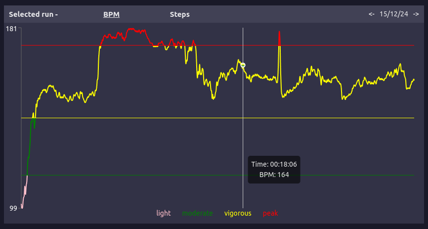

## [Live site here](https://runtacker.netlify.app)

## Why this project?

So my girlfriend got me a Fitbit for me birthday...

I had just started getting into running, and I found that Fitbit's data visualisation didn't allow for direct comparison of exercises (and I felt I needed more practice with APIs and wanted to learn a chart library) so I decided to make a dashboard for tracking my runs.

Dealing with the Fitbit API's rate limit made me want to learn backend as well, so this also includes a database with API for interfacing with the Fitbit API more efficiently.

## About this project

This is a custom made dashboard that visualises all of my tracked runs made through the Fitbit API.

### Features:

- List of all runs made with comparisons to last run:  
  
- Overall stats across all runs:  
  
- All runs shown in line chart with option for trend line and predicted next run:  
  
- Selected run data over time in a line chart:  
  
- Selected run data as ratios in pie chart:  
  
- Selected run data as statistics:  
  
- Predicted next run's stats based on previous runs:  
  

### Built using:

APIs:

- [Fitbit API](https://www.fitbit.com/dev)
- [Open-Meto](https://open-meteo.com/)

Front-end:

- [React](https://react.dev/)
- [Recharts](https://recharts.org/en-US/)
- [React Spinners](https://www.npmjs.com/package/react-spinners)
- [Netlify](https://www.netlify.com/)

Back-end:

- [Express](https://expressjs.com/)
- [PostgreSQL](https://www.postgresql.org/)
- [Neon](https://neon.tech/)
- [Koyeb](https://app.koyeb.com/)

### Acknowledgements:

- [heofs for their trendline code](https://github.com/heofs/trendline?tab=readme-ov-file)
- [Cotter for their code verifier/challenge](https://docs.cotter.app/sdk-reference/api-for-other-mobile-apps/api-for-mobile-apps#step-1-create-a-code-verifier)
