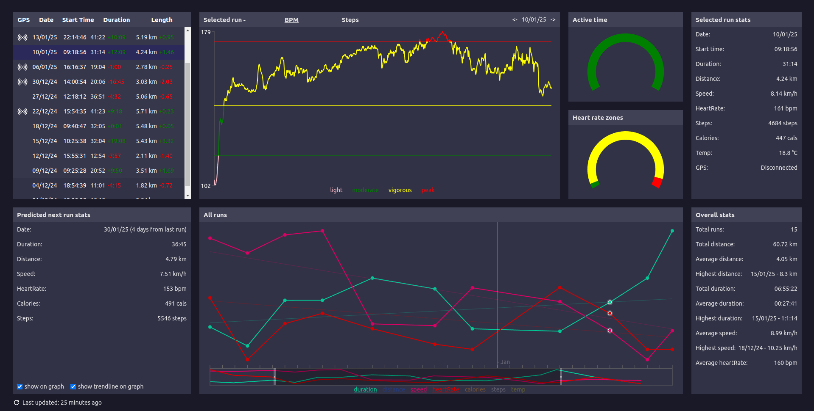
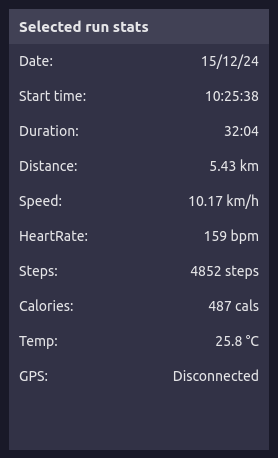

## [Live site here](https://runtacker.netlify.app)

## Why this project?

So my girlfriend got me a Fitbit for me birthday...

I had just started getting into running, and I found the official Fitbit app didn't allow for easy comparison of exercises, so I decided to make a dashboard for tracking my runs.

Dealing with the Fitbit API's rate limit made me want to learn backend as well, so this also includes a database with API for interfacing with the Fitbit API more efficiently.

## About this project

This is a custom made dashboard that visualises all of my tracked runs using data gathered from the Fitbit API.

### Features:

- **List of All Runs**:  
    
Compare runs at a glance.  
- **Overall Stat**:  
    
View aggregated statistics across all runs.  
- **Line Chart of All Runs**:  
    
Includes trend lines and predicted next run data.  
- **Live Chart of Selected Run**:  
    
Visualize a single run’s progress in a line chart.  
- **Pie Chart of Selected Run**:  
    
View selected run data as ratios.  
- **Selected Run Statistics**:  
    
Display key stats for individual runs.  
- **Predicted Next Run Stats**:  
    
Predicts next run based on previous performance.  

### Built With:

#### APIs:

- [Fitbit API](https://www.fitbit.com/dev)
- [Open-Meto](https://open-meteo.com/)

#### Front-end:

- [React](https://react.dev/)
- [Recharts](https://recharts.org/en-US/)
- [React Spinners](https://www.npmjs.com/package/react-spinners)
- [Netlify](https://www.netlify.com/)

#### Back-end:

- [Express](https://expressjs.com/)
- [PostgreSQL](https://www.postgresql.org/)
- [Neon](https://neon.tech/)
- [Koyeb](https://app.koyeb.com/)

### Acknowledgements:

- [heofs for their trendline code](https://github.com/heofs/trendline?tab=readme-ov-file)